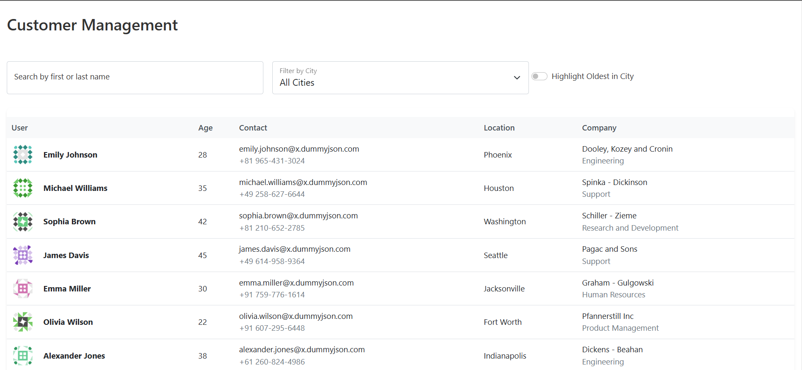

# DPS Angular Challenge

A modern Angular application for customer management with filtering and highlighting features.

## Project Context

You will be enhancing a new CRM (Customer Relationship Management) software aimed at managing customer data efficiently. Your task is to develop a feature that displays a searchable list of customers.

## Showcase

### Real-time Search and Filtering


The image above demonstrates the key features of our implementation:

1. **Name Search Field**: Type to instantly filter users by name
2. **City Dropdown**: Select a specific city to filter users
3. **Highlight Toggle**: Check to highlight the oldest person in each city
4. **Results Table**: Displays filtered users with highlighting

## Requirements

- Node.js (v14 or higher)
- npm (v6 or higher)
- Angular CLI (~12.2.0)

## Installation Guide

1. **Clone the repository**
   ```bash
   git clone <repository-url>
   cd dps-react-challenge
   ```

2. **Install dependencies**
   ```bash
   npm install
   ```

3. **Start the development server**
   ```bash
   npm start
   ```
   The application will be available at `http://localhost:4200/`

4. **Build for production**
   ```bash
   npm run build
   ```
   The build artifacts will be stored in the `dist/` directory.

## Development

- Run `ng serve` for a dev server
- Run `ng build` to build the project
- Run `ng test` to execute unit tests
- Run `ng lint` to lint the code

## Troubleshooting

If you encounter SCSS loading issues:
1. Ensure Angular CLI is installed globally: `npm install -g @angular/cli`
2. Clear Angular cache: `ng cache clean`
3. Remove node_modules and reinstall: 
   ```bash
   rm -rf node_modules
   npm install
   ```

## Contributing

1. Fork the repository
2. Create a feature branch
3. Commit your changes
4. Push to the branch
5. Create a Pull Request
